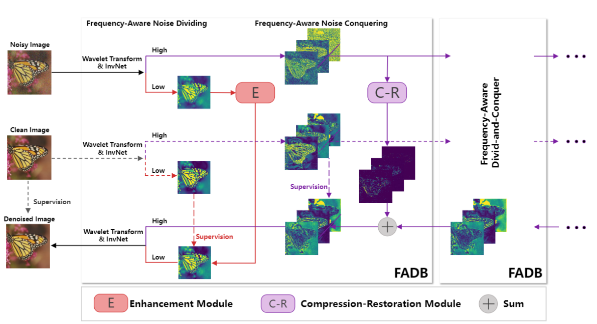

# Frequency-aware divide-and-conquer for efficient real noise removal (FADN)
This is the PyTorch implementation of paper: Frequency-aware divide-and-conquer for efficient real noise removal (FADN).

## Diagram of FADN

## Dependencies and Installation 
`pip install -r requirement.txt`


## Dataset Preparation
### SIDD 
Random crop SIDD for training and extract test set for testing.
```python
python Crop_SIDD.py
python SIDD_test_extract.py
```

### DND
Extract DND for evaluation.
```
python extract_DND.py
```

### NAM
Extract NAM for evaluation.
```
python extract_NAM.py
```

## Train Script
```cd codes
python python train.py -opt options/train/FADN.yml
```

## Pretrained model
Pretrained model are given in `./models/`

## Test Script
```
cd codes
python test_Real.py -opt options/test/test_FADN.yml
```

## Contact
If you have any questions, please contact <huangyunlu@bupt.edu.cn>.

